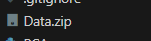
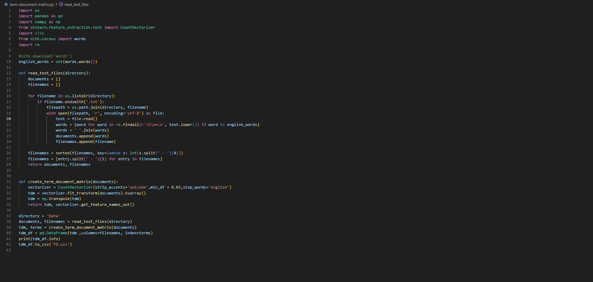
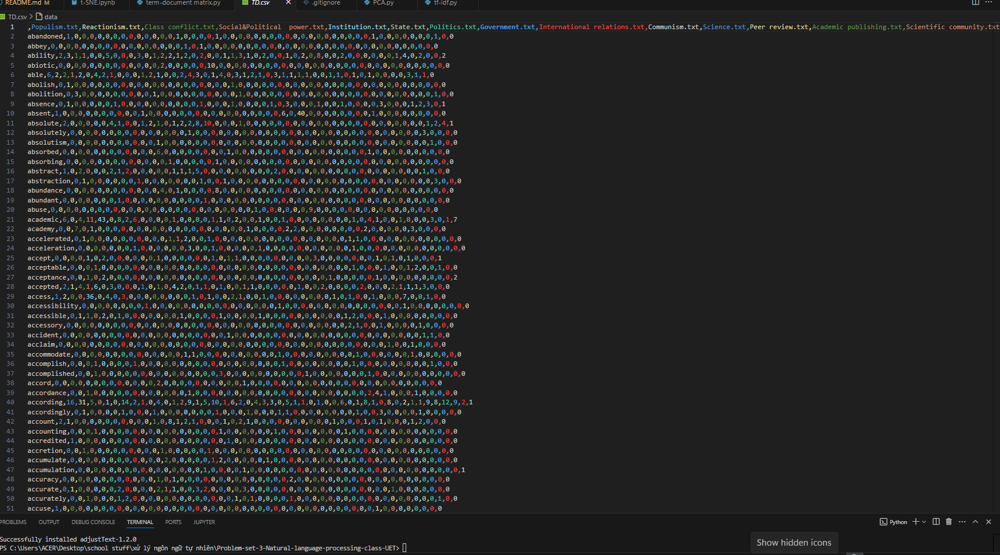
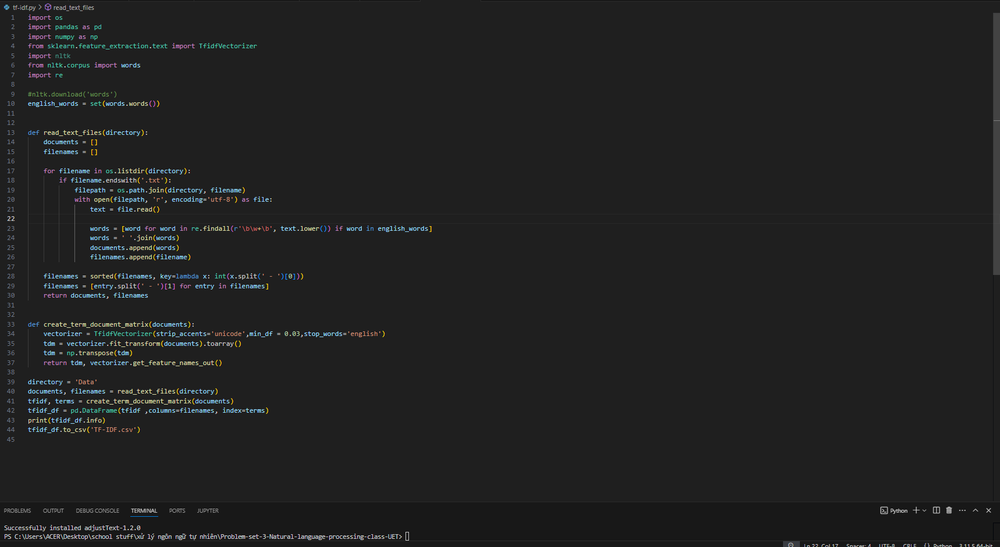
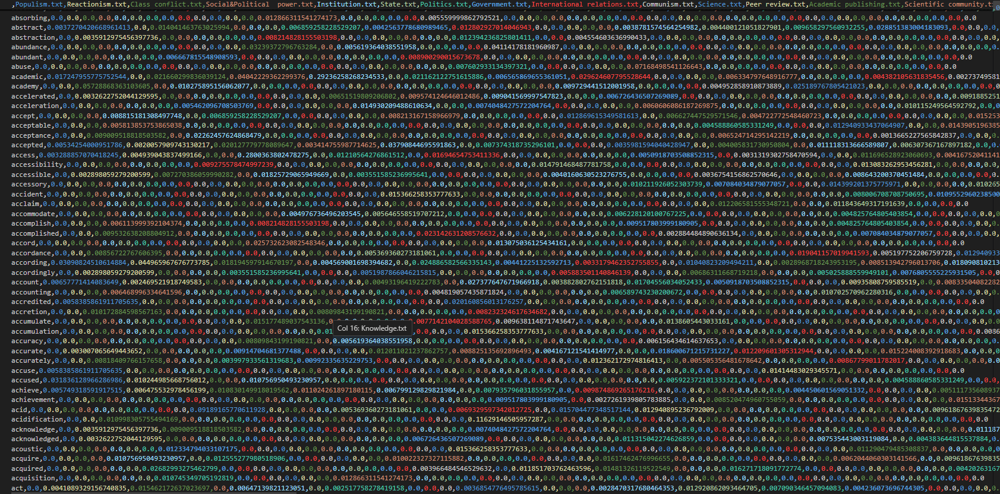
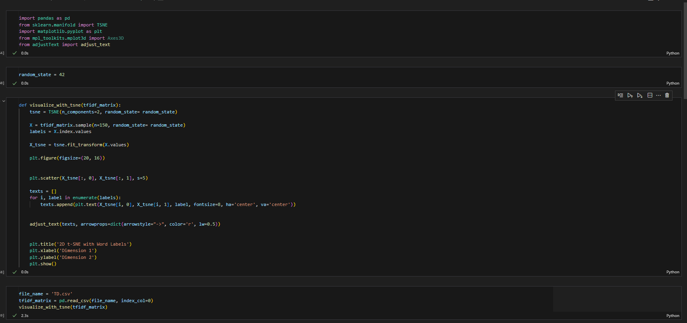
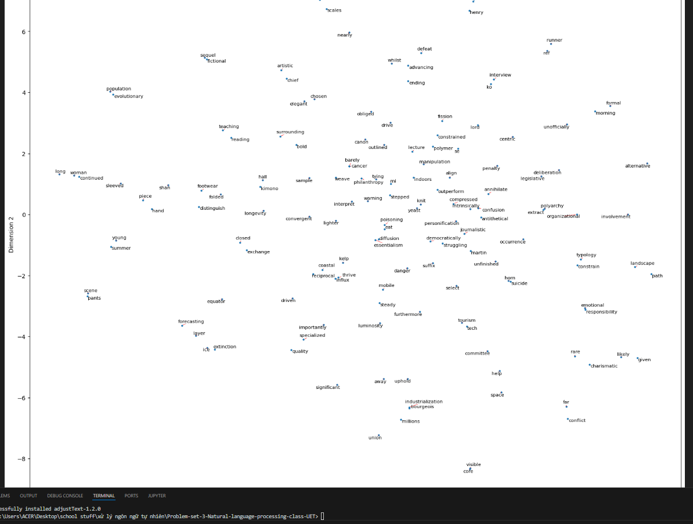

# Problem Set 3 - Natural Language Processing (UET)
https://github.com/CoderHung/Problem-set-3-Natural-language-processing-class-UET
## Overview

This project explores five topics:
- **Science**
- **Politics**
- **Nature**
- **Sports**
- **Fashion**

This project uses the term-document matrix, TF-IDF, and t-SNE to visualize word vectors.

## Files

- **Term-Document Matrix**: `TD.csv`
- **TF-IDF**: `TF-IDF.csv`
- **t-SNE Visualization**: 150 random word vectors from TD matrix projected on a 2D plane

## Instructions

### Step 1
Unzip the dataset:

### Step 2
run term-document matrix.py to generate the term-document matrix:

### Step 3
run tf-idf.py to compute TF-IDF matrix:

### Step 4
Visualize word vectors using t-SNE:

*(To get different results, modify the `random_state` variable in the t-SNE script.)*

